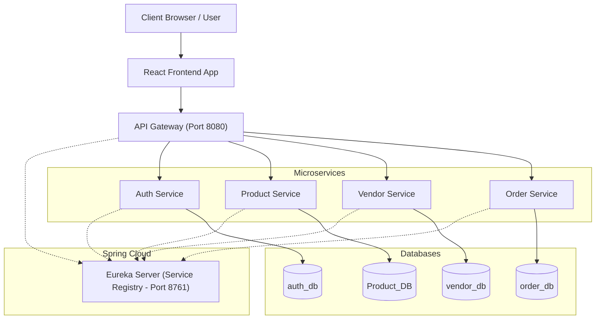

# OmniPrint

OmniPrint is a comprehensive print management platform built with a microservices architecture. It connects clients who need print jobs with vendors capable of fulfilling them, managing the entire lifecycle from product configuration and quoting to order placement and tracking.

## Architecture

The application is built using a modern microservices architecture with a React-based frontend and Spring Boot backend services.

### Low-Level Architecture



- **Frontend**: A React application (built with Vite) that provides interfaces for clients and vendors.
- **API Gateway**: Serves as the single entry point for all frontend requests, routing them to the appropriate microservices and handling authentication verification.
- **Eureka Server**: Service Registry that keeps track of all running microservices instances.
- **Auth Service**: Manages user registration, login, and JWT generation.
- **Product Service**: Manages the global master catalog of products, categories, and dynamic configuration filters.
- **Vendor Service**: Manages vendor profiles, vendor-specific product pricing, and routing logic to find the nearest vendors for an order.
- **Order Service**: Handles order creation, processing, and status tracking for both clients and vendors.

## Databases

Each microservice manages its own isolated PostgreSQL database, adhering to the database-per-service pattern:

1. **auth_db**: Stores user credentials, roles, and authentication data.
2. **Product_DB**: Stores the master product catalog, categories, pricing tiers, and configuration filters.
3. **vendor_db**: Stores vendor profiles, vendor-specific product catalogs (overrides), and geographical locations for routing.
4. **order_db**: Stores all order details, statuses, and history mapping clients to vendors.

## API Reference

The APIs are grouped by their respective domains. The Frontend accesses all APIs via the API Gateway.

### Auth API (`/api/v1/auth`)
- `POST /register`: Register a new user (Client/Vendor/Admin).
- `POST /login`: Authenticate a user and receive a JWT token.

### Product API (`/api/products` & `/api/admin/products`)
- `GET /api/products`: Retrieve all active master products.
- `GET /api/products/{slug}`: Retrieve specific product details for configuration.
- `POST /api/admin/products`: (Admin) Create a new master product.
- `PUT /api/admin/products/{id}`: (Admin) Update a product.
- `DELETE /api/admin/products/{id}`: (Admin) Delete a product.

### Vendor API (`/api/vendors`)
- `POST /profile`: Create or update a vendor profile (requires token).
- `POST /quote`: Calculate and retrieve the best quote from a vendor based on product, location, quantity, and specific configuration filters.
- `GET /{vendorId}/products`: Retrieve the product catalog offered by a specific vendor.
- `POST /{vendorId}/products`: Add a master product to a vendor's catalog with vendor-specific pricing.
- `PUT /{vendorId}/products/{productId}`: Update vendor pricing for a product.
- `DELETE /{vendorId}/products/{productId}`: Remove a product from a vendor's catalog.

### Order API (`/api/orders`)
- `POST /`: Place a new order (from a Client to a selected Vendor).
- `GET /client`: Retrieve order history for the logged-in Client.
- `GET /vendor`: Retrieve orders assigned to the logged-in Vendor.
- `PATCH /{orderId}/status`: Update the status of a specific order (e.g., PLACED -> MANUFACTURING).

## How to Run

### Prerequisites
- Java 17+
- Node.js (v18+)
- PostgreSQL installed and running on port 5432
- Maven

### Database Setup
Ensure you create the following databases in your PostgreSQL instance before starting the application. The default username is `postgres` and password is `Ayush@123` (update in `application.properties` if different).
```sql
CREATE DATABASE auth_db;
CREATE DATABASE Product_DB;
CREATE DATABASE vendor_db;
CREATE DATABASE order_db;
```

### Backend Setup
You must start the backend services in a specific order.

1. **Start Eureka Server**:
   Navigate to the `EurekaServer` directory and run:
   ```bash
   mvn spring-boot:run
   ```
2. **Start Microservices**:
   Open separate terminals for each of the following and run `mvn spring-boot:run`:
   - `auth-service`
   - `product-service`
   - `vendor-service`
   - `order-service`
3. **Start API Gateway**:
   Navigate to the `api-gateway` directory and run:
   ```bash
   mvn spring-boot:run
   ```

### Frontend Setup
1. Navigate to the frontend directory:
   ```bash
   cd Frontend/OmniPrint
   ```
2. Install dependencies:
   ```bash
   npm install
   ```
3. Run the development server:
   ```bash
   npm run dev
   ```

The application frontend will be available (typically at `http://localhost:5173`) and the backend API Gateway is accessible at `http://localhost:8080`.